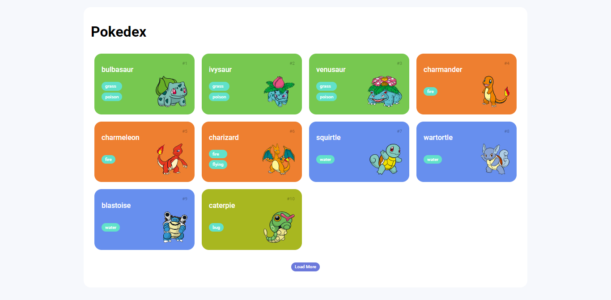

# Pokedex

A pokedex foi feita com html/css/js puro, fazendo o consumo da pokeApi
ele foi forkado de um projeto base incompleto, completado e modificado como demonstrarei.

Para visualizar o resultado final é necessário fazer o download do projeto em sua máquina e clicar no arquivo html para ser aberto com algum navegador, ou utilizar alguma ferramenta do vscode para fazer a visualização como o live server.

## Projeto base

No conteúdo inicial do projeto o código estava inacabado e precisava de algumas alterações, realizei as modificações necessárias e o resultado ficou como mostra abaixo:

A ideia para finalizar a parte inicial era de mostrar os pokemons na tela como uma lista (uma pokedex).

## Modificações autorais

A principal modificação que criei no código do projeto foi a adição de
detalhes a mais de cada pokemon, que aparecem no momento em que clicamos em um deles
:

