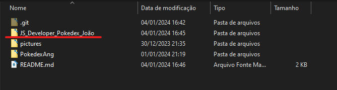
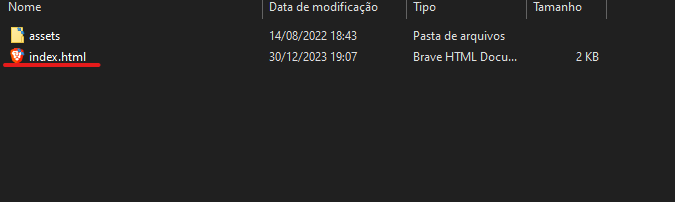
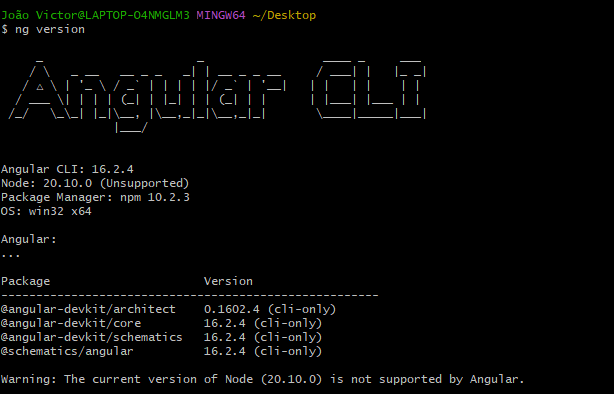
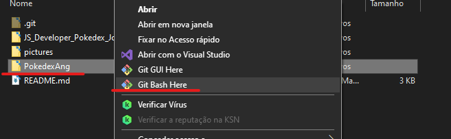
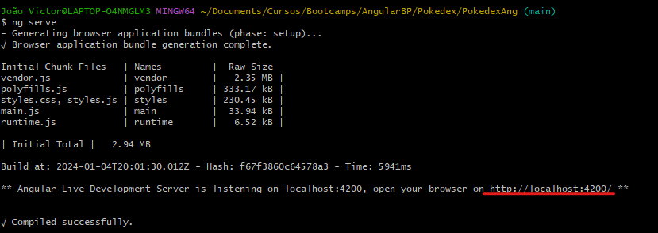
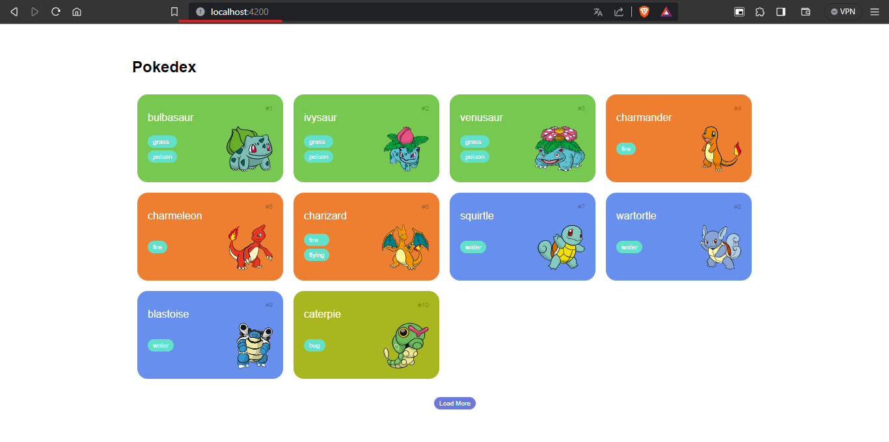
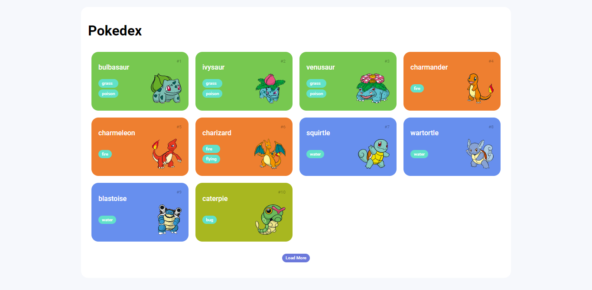
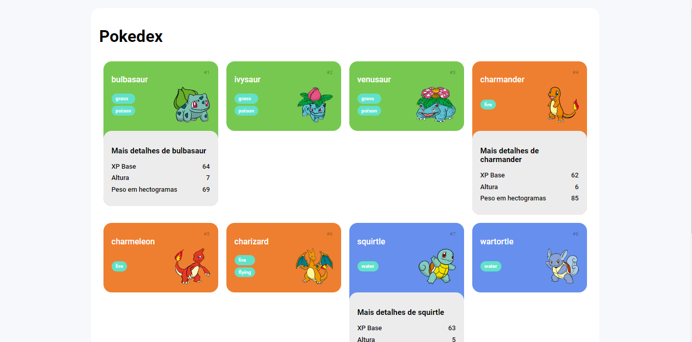

# Pokedex

[PT-BR](#pt-br) - Versão em Protugues

## Depedencies - Dependências

[NodeJS](https://nodejs.org/en/download/)  
[AngularCLI](https://angular.io/docs)

# EN-US

## Description

The Pokedex was created with pure HTML/CSS/JS, fetching data from the PokeAPI. It was forked from an incomplete base project, completed, and modified as demonstrated.

To view the final result, download the project to your machine and open the HTML file in a browser or use a tool like Live Server in VSCode for visualization.

## Ways to View Both Projects

As there are two identical projects but built with different technologies, the ways to view them are also different.

### JS Pokedex

The first way is with the project built with pure HTML/CSS/JS. To view it, simply click on the project's HTML file, and it will open in your default browser:

1. Open the directory with the index.html file:

   

2. Click on the index.html file:

   

### Angular Pokedex

To view the Angular project, there are a few more steps, as the code needs to be compiled by Angular to generate the HTML, CSS, and JS that will be displayed.

1. Make sure Angular is installed on your computer. You can check this by typing the command `ng version` in any terminal. I will use Git Bash:

   

2. Navigate to the Angular project directory and open it in your terminal:

   

3. Inside the terminal, execute the command "ng serve" or "npm start," and a link to your machine's localhost will be generated:

   

4. Enter the link in your browser and see the generated page:

   

## Base Project

In the initial state of the project, the code was unfinished and required some modifications. I made the necessary changes, and the result is as shown below:

The idea to finish the initial part was to display the Pokémon on the screen as a list (a Pokedex).

## Author's Modifications

The main modification I made to the project code was adding additional details for each Pokémon, which appear when we click on one of them:

# PT-BR

## Descrição

A pokedex foi feita com html/css/js puro, fazendo o consumo da pokeApi
ele foi forkado de um projeto base incompleto, completado e modificado como demonstrarei.

Para visualizar o resultado final é necessário fazer o download do projeto em sua máquina e clicar no arquivo html para ser aberto com algum navegador, ou utilizar alguma ferramenta do vscode para fazer a visualização como o live server.

## Formas de visualizar os dois projetos

Como há dois projetos iguais mas feitos com tecnologias diferentes, a forma de visualizá-los também pe diferente.

### JS Pokedex

A primeira forma é com o projeto feito com html/css/js puro, para poder visualizar é necessário apenas clicar no html do projeto e ele abrirá em seu navegador padrão instalado em seu computador :

1 - Abra o diretório com o arquivo index.html :

2 - Clique no arquivo index.html :

### Angular Pokedex

Para poder visualizar o projeto feito em Angular tem um pouco mais de passos a serem feitos pois o código precisa ser compilado pelo Angular para poder ser gerado o html,css e js que serão mostrados.

1 - Certifique-se que o Angular está instalado em seu computador, isso pode ser feito digitando o código ng version em qualquer terminal, eu utilizarei o git bash :

2 -  Vá ao diretório do projeto Angular e abra em seu terminal :

3 - Dentro do terminal execute o comando "ng serve" ou "npm start" e logo após será gerado um link para o localhost de sua máquina :

4 - Digite o link em seu navegador e veja a página gerada : 

## Projeto base

No conteúdo inicial do projeto o código estava inacabado e precisava de algumas alterações, realizei as modificações necessárias e o resultado ficou como mostra abaixo:

A ideia para finalizar a parte inicial era de mostrar os pokemons na tela como uma lista (uma pokedex).

## Modificações autorais

A principal modificação que criei no código do projeto foi a adição de
detalhes a mais de cada pokemon, que aparecem no momento em que clicamos em um deles
:

